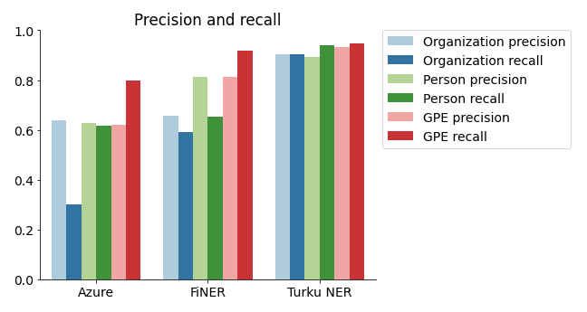
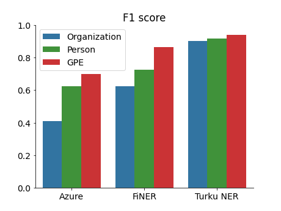

---
title: Evaluation of Finnish named-entity recognition (NER) services
author:
- Antti Ajanki:
  name: Antti Ajanki
  email: antti.ajanki@iki.fi
date: 2021-08-04
license:
  name: CC BY 4.0
  href: https://creativecommons.org/licenses/by/4.0/
...

This study aims to

1. compare the accuracy of Finnish NER services and libraries, and
2. evaluate the effort required to setup and use the said services.

The [source code for the analysis](https://github.com/aajanki/fi-ner-eval) is available.

## What is named-entity recognition?

Named-entity recognition (NER) is a technique in natural language processing that aims to detect and locate instances of certain key categories (entities) in unstructured text. An entity is a name of an object belonging to one of the predefined categories like a person name, location or organization. A NER algorithm could, for example, detect the word sequence *Sauli Niinistö* in text and classify it as a person and *the United Nations* as an organization. The next picture shows an example sentence with NER annotations.

NER can be applied to categorize news articles, to extract information from CVs or other semi-structured documents, as part of text summarization or on other similar applications.

## Services compared in the study

The following open source libraries and cloud services are compared:

- FiNER library, part of the [Finnish Tagtools](https://korp.csc.fi/download/finnish-tagtools/) application collection (version 1.5.1)
- [The Finnish NER library](https://turkunlp.org/fin-ner.html) by TurkuNLP research group at the University of Turku (version [combined-ext-model-130220](http://dl.turkunlp.org/turku-ner-models/combined-ext-model-130220.tar.gz)). Referred as "Turku NER" in the remaining of this work.
- [Microsoft Azure Text Analytics](https://azure.microsoft.com/en-us/services/cognitive-services/text-analytics/) cloud service (API v3.1, accessed on Jul 30th, 2021)

These represent alternative technical approaches to NER. FiNER is based on hand-crafted detection rules. This approach was popular before the current deep learning fashion. The Turku NER system is built on top of the large pre-trained FinBERT transformer model. Both of these are distributed as software that the user runs on their own hardware. Azure Text Analytics, on the other hand, is a cloud API. Azure utilizes a deep learning model with transfer learning between languages. Azure does not publish exact details of their model.

## The evaluation procedure

All NER systems were evaluated by running them on the text documents of the UD-Finnish-TDT corpus test set. The predicted NER labels were compared against the manually annotated ground truth labels. The ground truth annotations are part of the [TurkuONE corpus](https://github.com/TurkuNLP/turku-one). The ground truth data consists of about 70,000 tokens and 3,800 NE instances.

The quality of predictions is assessed by computing precision (the fraction of predicted labels that are correct), recall (the fraction of entity chunks in the ground truth that are predicted correctly) and F1 score (the harmonic mean of precision and recall) values. These three values are computed separately for person, organization and geopolitical entity (GPE) types.

Note that FiNER and Turku NER output also other NE (named-entity) types than the three ones considered here. Turku NER is able to output [18 NE types](https://turkunlp.org/fin-ner.html) in total and FiNER [22 NE types](https://github.com/Traubert/FiNer-rules/blob/master/finer-readme.md) (mostly various subtypes of person, organization and location). The additional NE types include e.g. product and event names and date and time instances. The Finnish language version of Azure NER is limited to detect just person, organization and GPE.

## Results: Prediction quality

The precision, recall and F1 scores are displayed on the plots below.

Turku NER attains the highest F1 scores with values above 90% on all NE types. FiNER can just about compete on GPE detection but loses clearly on the other two NE types. Azure NER's overall performance is poor with the terrible recall on organizations as its low point.

### Discussion of the results

One difficulty in comparing NER algorithms is there are no universal definitions for the various NE types. Even though two algorithms may detect nominally same NE types they might have been trained to perform slightly different classification. For example, FiNER and Turku NER has been trained to classify municipalities (*Karkun kunta*) as organizations and provinces (*Turun lääni*) as locations. Developers of a different NER system might equally well decide to classify both as locations. See [the data annotation guidelines for FiNER](https://github.com/Traubert/FiNer-rules/blob/master/info/annotation_guidelines.md) and [Turku NER](https://github.com/TurkuNLP/turku-ner-corpus/blob/master/docs/Turku-NER-guidelines-v1.pdf) for more details. The guidelines for the Azure NER are not documented publicly.

This study probably over-estimates the performance of Turku NER in practical applications, because the test documents come from the same domains as the documents that has been used to train the model. The evaluation documents are the test set of the UD-Finnish-TDT corpus, and the training set of that corpus has been part of the training data for the Turku NER. It's challenging to estimate how much the Turku NER numbers benefit from this (and the effect size obviously varies between domains). It is unknown if the same data has been used to train the Azure NER model. If that is the case then the Azure numbers are similarly inflated. (FiNER has been trained on a distinct dataset.) When applying NER, it's crucial to evaluate candidate algorithms on data from your domain.

## Results: Ease of use

The secondary goal of this study was to find out how easy it is to setup and use each of the tested services. This section describes the setup effort and licensing and pricing information. See the [evaluation source code](https://github.com/aajanki/fi-ner-eval) for concrete implementation examples.

FiNER is distributed as a pre-compiled \*nix compatible executable. The distributed executable is statistically linked and should run on most \*nix environments out-of-the-box. I was unable to find a pre-compiled version for Windows, so Windows developers would need to compile the application from the source code by themselves. FiNER is a CLI application that reads the text of a document from the standard input and write tokens and their predicted labels on the standard output. The license of FiNER is GPL v3.

The Turku NER software consists of two parts the model weights, which are downloadable from the university website, and the model source code distributed as Python package keras-bert-ner. Running the code is a bit complicated as keras-bert-ner depends on the legacy Tensorflow 1.x which is available (in a pre-compiled form) only on legacy Python versions 3.7 or older. This means the project must either be restricted to Python 3.7 or use two Python interpreters, v3.7 for the NER model and a modern Python for the rest of the project code. I choice to take the latter option and created a Python virtual environment with Python 3.7 for the Turku NER and a second one with Python 3.9 for all other code. Alternatively, one could run the Turku NER and its dependencies in a Docker container. Hopefully, someone will port the keras-bert-ner package to Tensorflow 2.x (which supports the latest Python) one day.

The Turku NER interface is exposed as an (local) HTTP server. The text of a document is sent as a HTTP request and server returns the tokenized text with predicted NER labels as a response. Alternatively, it should be possible to integrate the Turku NER code directly as part of a Python program (and access the NER predictions by a Python function call instead of an HTTP request), but this would restrict the project code to use Python 3.7 as discussed above. I didn't explore this option further.

The keras-bert-ner pacakge is distributed under the MIT license. The license for the Turku NER model weights is not explicitly stated anywhere. One would need to ask the researchers to clarify the licensing terms before distributing the model weights as a part of a software.

The Azure NER system is a component on the Microsoft Azure cloud computing service. It can be deployed through the Azure console or (on a more serious software engineering project) through an Azure DevOps pipeline deployment job. At the deployment stage you get an API key for accessing the cloud API. A client library for accessing the service exists for Python and several other popular programming languages. It is also possible the access the service through a REST API. The Azure NER client accepts the text as an input and outputs the detected entities and their text offsets. The input size is limited to rather low 5,120 characters. To process longer documents, it is necessary to write code for splitting the documents and re-combining the results (the client library doesn't do this automatically). The [service pricing](https://azure.microsoft.com/en-us/pricing/details/cognitive-services/text-analytics/) is based on the usage with costs of less than 1 € per 1,000 text records.

## Conclusions

The Turku NER is clearly the most accurate of the tested services. Despite the slightly cumbersome setup with the legacy Tensorflow, the Turku NER should remain the first choice in most cases. However, the prediction quality should always be evaluated on representative data from the problem domain.